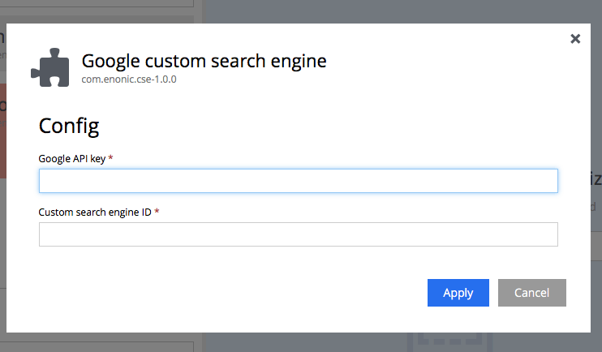
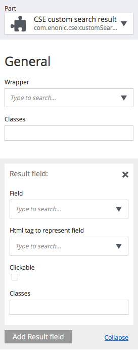

# Google Custom Search APP

## Releases and Compatibility

| App version | Required XP version |
| ----------- | ------------------- |
| 1.0.0 | 6.6.0 |

## Usage

### Install cse

Install app-cse by deploying to the installation

    ./gradlew deploy

### API-key and engine id

To be able to get search result from Google, you need an api-key and a search engine id from Google. The api-key is obtained by setting up a credential at Googles [API manager](https://console.developers.google.com), and enabling the "custom search API".

Get the search engine id by registering an engine at Googles [custom search engine console](https://cse.google.com).

### Site config

In the siteconfig for the app, apply your API-key and search engine id.

### Parts

There are 2 sets of parts to choose from. The CSE search and result parts, and the CSE *custom* search and result parts.

#### CSE Search and result parts
This is the quickest way to add cse to your site. Simple add the search field part to any page. Your settings in the [custom search engine console](https://cse.google.com) will manage how the search result will be shown.

If you want the search result on a different page, add the "CSE search result" part to the destination page, and link to it in the "CSE search field" part config.

#### CSE *custom* search and result parts

If you want to manage the css and behavior to the searchfield and result, you can use these parts. The custom search field provide an input and a submit/search button.

The custom search result is a very flexible. You need to choose which fields from the search result, from google, you want to show. When you choose a field, you also choose what kind of html-tag this field is going to be wrapped in. Choose between h2 - h6, span, p and a tags. You can add classes to the tag as well. Also choose which html-tag is goin to wrap the results. Choose between ol, li, div or article.

Add styling in your own app, that applies to the html elements and classes you set to make the search result exaclty how you want it.

##### CSE *custom* result part options

| General | | |
| ---- | ----------- | ---- |
| wrapper | Choose a wrapping html element for the search result elements. | Choose between: article, ol > li, ul > li, and div. |
| Classes | Add classes to the wrapper | Sample: "cse-result col-xs-12"|

| ResultField | | |
| ---- | ----------- | ---- |
| Field | Choose a field to show | See below for fields to choose from with sample data |
| Html tag to represent field | Choose which html element for the searchresult. | Choose between: h2,h3, h4, h5, h6, a, p, span |
| Clickable | Check if this field should be a link to the searchresult content | |
| Classes | Add classes to the searchresult element | Sample: "cse-result-item" | |

| Pagination | | |
| ---- | ----------- | ---- |
| Show pagination | Add a pagination in the bottom of the searchresult | |
| Previous link text | | Default text "previous page" |
| Next link text | | Default text "next page" |

Googles searchresult fields available:

    kind: "customsearch#result",
    title: "lib-thymeleaf — Enonic XP 6.1 documentation",
    htmlTitle: "lib-thymeleaf — Enonic XP 6.1 documentation",
    link: "http://xp.readthedocs.io/en/6.1/reference/libraries/thymeleaf/index.html",
    displayLink: "xp.readthedocs.io",
    snippet: "var thymeleaf = require('/lib/xp/thymeleaf'). Thymeleaf also supports a set of View \nFunctions. The methods implemented in this library are listed below. render.",
    htmlSnippet: "var thymeleaf = require(&#39;/lib/xp/thymeleaf&#39;). Thymeleaf also supports a set of <b>View</b>  \n<b>Functions</b>. The methods implemented in this library are listed below. render.",
    cacheId: "PoeWLlrxwGsJ",
    formattedUrl: "xp.readthedocs.io/en/6.1/reference/libraries/thymeleaf/index.html",
    htmlFormattedUrl: "xp.readthedocs.io/en/6.1/reference/libraries/thymeleaf/index.html", 
